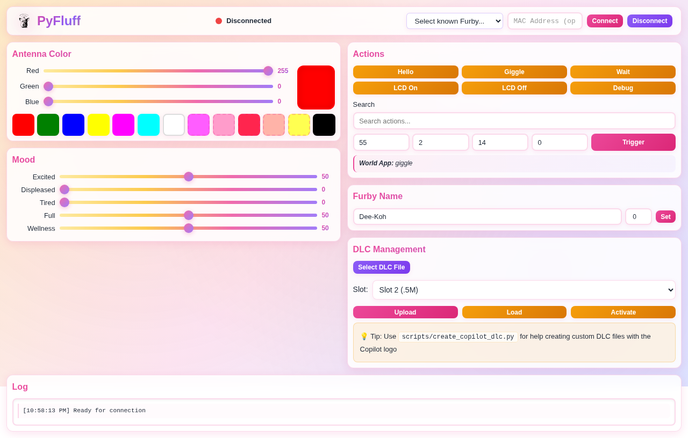

# Displaying the GitHub Copilot Logo on Furby's Eyes

This guide explains how to display custom content, including the GitHub Copilot logo, on your Furby Connect's LCD eyes.

## Overview

Furby Connect's LCD eyes can display custom animations and images through DLC (DownLoadable Content) files. PyFluff now provides full support for uploading and managing DLC files through:
- Web interface
- Command-line interface (CLI)
- Python API

## Quick Start

### 1. Get or Create a Copilot Logo DLC

**Option A: Community Resources**
- Check the PyFluff/bluefluff community for pre-made DLC files
- Look for shared Copilot logo DLC files in discussions/issues

**Option B: Create Your Own**
- Use the guide script: `python scripts/create_copilot_dlc.py`
- Follow the detailed instructions provided
- Note: Creating working DLC files requires understanding the proprietary format

### 2. Upload the DLC via Web Interface

1. Start PyFluff server:
   ```bash
   python -m pyfluff.server
   ```

2. Open your browser to `http://localhost:8080`

3. Connect to your Furby using the Connect button

4. Scroll to the **DLC Management** section

5. Click **Select DLC File** and choose your DLC file

6. Select a slot (Slot 0=2M, Slot 1=1M, Slot 2=.5M)

7. Click **Upload** (takes 3-5 minutes)

8. Click **Load** to load the DLC from the slot

9. Click **Activate** to make it active

### 3. Monitor Upload Progress

Use the Debug menu to monitor DLC status:
```bash
python -m pyfluff.cli debug
```

Or click the **Debug** button in the web interface.

DLC slot states:
- `0` = Empty slot
- `1` = Upload in progress
- `2` = Uploaded, ready to load
- `3` = Active and ready to use

### 4. Trigger the Copilot Logo

Once activated, DLC content is available at action input 75:

**Via Web Interface:**
- Enter `75` in the Input field
- Enter `0` for Index, Subindex, and Specific
- Click **Trigger**

**Via CLI:**
```bash
python -m pyfluff.cli action --input 75 --index 0 --subindex 0 --specific 0
```

**Via Python API:**
```python
from pyfluff import FurbyConnect
import asyncio

async def show_copilot_logo():
    async with FurbyConnect() as furby:
        await furby.trigger_action(input=75, index=0, subindex=0, specific=0)

asyncio.run(show_copilot_logo())
```

## Detailed Instructions

### Understanding DLC Files

DLC files are proprietary content packages that contain:
- **Images**: LCD eye animations in Furby's custom 64-color palette
- **Audio**: Sounds encoded in GeneralPlus A1800 codec
- **Actions**: Sequences that coordinate movement, sound, and display

### DLC Slot Management

Furby has 3 DLC slots with different sizes:
- **Slot 0**: 2 MB (largest, for complex content)
- **Slot 1**: 1 MB (medium)
- **Slot 2**: 0.5 MB (smallest, fastest upload)

### Upload Process

1. **Select File**: Choose a `.dlc` or `.DLC` file from your computer

2. **Choose Slot**: Select an appropriate slot based on file size

3. **Upload**: The upload takes 3-5 minutes depending on file size
   - Progress is shown in the web interface
   - Nordic Packet ACK is automatically enabled for monitoring
   - If upload fails, check Bluetooth connection and try again

4. **Load**: After upload completes (debug shows `2`), load the DLC

5. **Activate**: Make the DLC active (debug shows `3`)

### Troubleshooting

**Upload Fails:**
- Check Bluetooth connection is stable
- Ensure file is a valid DLC file
- Try a smaller slot or smaller file
- Check debug menu for slot status

**Logo Doesn't Display:**
- Verify DLC is activated (debug shows `3`)
- Try triggering different action indices (input 75, index 0-10)
- Check that DLC contains image data (not just audio)

**Connection Lost During Upload:**
- Restart PyFluff server
- Reconnect to Furby
- Try uploading again (Furby may resume)

## CLI Commands Reference

```bash
# Upload DLC file
python -m pyfluff.cli upload-dlc copilot_logo.dlc --slot 2

# Load DLC from slot
python -m pyfluff.cli load-dlc 2

# Activate loaded DLC
python -m pyfluff.cli activate-dlc

# Deactivate DLC
python -m pyfluff.cli deactivate-dlc 2

# Delete DLC from slot
python -m pyfluff.cli delete-dlc 2

# Trigger DLC content
python -m pyfluff.cli action --input 75 --index 0 --subindex 0 --specific 0

# Open debug menu
python -m pyfluff.cli debug
```

## Python API Reference

```python
from pyfluff import FurbyConnect
from pyfluff.dlc import DLCManager
from pathlib import Path
import asyncio

async def complete_dlc_workflow():
    """Complete workflow: upload, load, activate, and trigger."""
    
    async with FurbyConnect() as furby:
        # Create DLC manager
        dlc = DLCManager(furby)
        
        # Upload DLC file
        print("Uploading DLC...")
        await dlc.upload_dlc(
            dlc_path=Path("copilot_logo.dlc"),
            slot=2
        )
        print("Upload complete!")
        
        # Load DLC
        print("Loading DLC...")
        await dlc.load_dlc(slot=2)
        
        # Activate DLC
        print("Activating DLC...")
        await dlc.activate_dlc()
        
        # Wait a moment for activation
        await asyncio.sleep(1)
        
        # Trigger the content
        print("Displaying Copilot logo...")
        await furby.trigger_action(input=75, index=0, subindex=0, specific=0)
        
        print("Done!")

# Run the workflow
asyncio.run(complete_dlc_workflow())
```

## Creating Custom DLC Files

### Current Status

Creating functional DLC files from scratch is complex and requires:
1. Understanding Furby's proprietary format
2. Converting images to Furby's 64-color palette
3. Encoding audio in A1800 codec
4. Structuring action sequences properly

### Available Tools

**PyFluff Guide Script:**
```bash
python scripts/create_copilot_dlc.py
```
This provides comprehensive documentation and guidance on the DLC creation process.

**Original Bluefluff Tools:**
- `inject_binary.py` - Inject content into existing DLC files
- `toimage.py` - Extract images from DLC files
- `visualize_audio.py` - Visualize audio content

### Community Approach

The best way to get a Copilot logo DLC is through the community:
1. Check PyFluff GitHub Discussions
2. Search for shared DLC files
3. Collaborate with other users
4. Share your creations!

## Web Interface Features

The DLC Management section in the web interface includes:

- **File Selection**: Browse and select DLC files from your computer
- **Slot Selection**: Choose which memory slot to use
- **Upload Progress**: Visual progress bar during upload
- **Quick Actions**: One-click Load and Activate buttons
- **Helpful Tips**: Links to documentation and tools
- **Integration**: Works seamlessly with other Furby controls



*The DLC Management section allows easy upload and management of custom DLC files*

## Safety Notes

⚠️ **Important Warnings:**

1. **Backup**: Once a DLC is uploaded, it cannot be downloaded back
2. **Experimental**: Custom DLC files may cause unexpected behavior
3. **No Warranty**: Using custom DLC may void warranty (if applicable)
4. **Brick Risk**: Malformed DLC files could potentially brick your Furby
5. **Test First**: Test on a non-primary Furby if possible

## Additional Resources

- [DLC Format Documentation](dlcformat.md)
- [Flashing DLC Guide](flashdlc.md)
- [Actions Reference](actions.md)
- [PyFluff GitHub Repository](https://github.com/benbalter/PyFluff)
- [Original Bluefluff Project](https://github.com/Jeija/bluefluff)

## Contributing

Want to help improve DLC support in PyFluff? We need:
- DLC format reverse engineering
- Image palette conversion tools
- A1800 audio codec support
- Sample DLC files for testing
- Documentation improvements

See the [Contributing Guide](../README.md#contributing) for more information.

## Support

If you have questions or issues:
1. Check the [documentation](../)
2. Search [GitHub Issues](https://github.com/benbalter/PyFluff/issues)
3. Ask in [GitHub Discussions](https://github.com/benbalter/PyFluff/discussions)
4. Review the [bluefluff community resources](https://github.com/Jeija/bluefluff)

---

**Note**: This guide assumes you have PyFluff installed and a Furby Connect device. See the main [README](../README.md) for setup instructions.
